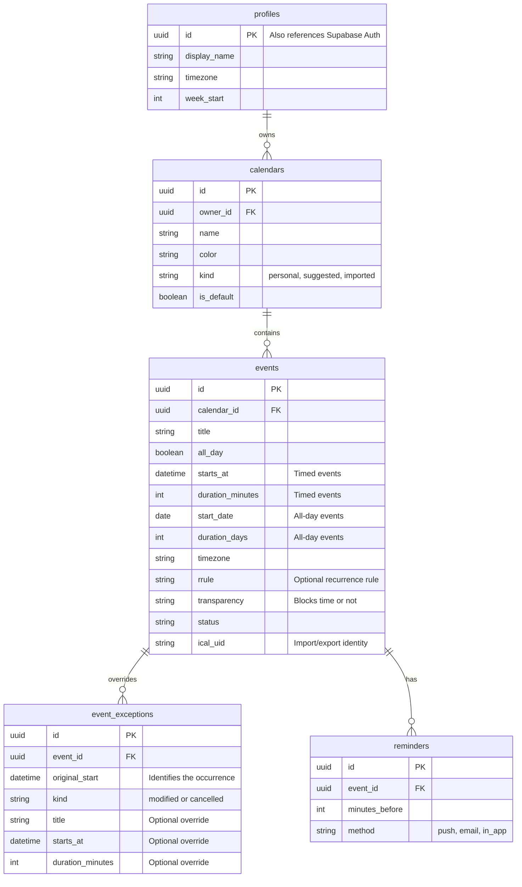
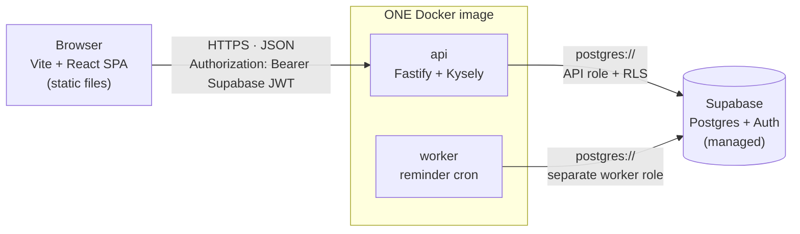

# Caldochi

A calendar app with a planning algorithm based on your activities and commitments to suggest a daily itinerary

## Problem and Scope

I want to learn more about web development. I plan my day every day manually in the calendar app, but I want to see suggestions for a daily plan. The aim of this calendar app is to first teach me more about web development and second to have suggested daily schedules for the activities I want to do.

Learning targets are tracked in [learning-goals.md](learning-goals.md), and the
architecture below is chosen to exercise them.

## Requirements for v1

- support different calender views (day/month/year)
- send reminders to users about event
- event view for details
- export/import events
- a planning algorithm to suggest daily schedule

## Requirements for v2

- multi-user support
  - shared calendars
  - rsvps

## Data model

Key attributes and relationships (PK = primary key, FK = foreign key).
Supabase Auth manages accounts; each profile shares its account's ID.



**Occurrences are calculated, not stored**, so they have no table in this diagram.
The database stores the event's recurrence rule and any exceptions. When a date
range is requested, those records generate the individual occurrences in memory. See `The core read: occurrences, not events` section

Signup creates a profile and a default calendar. RLS restricts access to the
owner's data. Planner entities are described in [planning-algorithm.md](planning-algorithm.md#data-model).

## API Surface

### Layering

Supabase/PostgREST already exposes every table over REST, and RLS makes those calls
safe from the browser. So we only hand-write endpoints for operations that **cannot
be expressed as table CRUD**:

| Goes through the Supabase client | Needs a real endpoint                   |
| -------------------------------- | --------------------------------------- |
| calendars CRUD                   | expanding recurrences over a date range |
| profile read/update              | scoped edit/delete of a recurring event |
| reminder add/remove              | `.ics` import/export                    |
|                                  | plan generation (later)                 |

Everything in the right column either returns something that isn't a table row, or
writes several rows in one transaction.

### The core read: occurrences, not events

The calendar displays individual occurrences within the selected date range.
A weekly standup is stored as **one event**, but appears once for each week.
To build the view, the app calculates occurrences in memory for that date range,
applies any changes or cancellations, and returns the details below. These results
are sent to the calendar view without creating new database rows:

```json
{
	"occurrences": [
		{
			"eventId": "8f3a…",
			"occurrenceStart": "2026-09-16T13:00:00Z",
			"start": "2026-09-16T18:00:00Z",
			"end": "2026-09-16T19:00:00Z",
			"allDay": false,
			"title": "Standup",
			"calendarId": "1c7e…",
			"transparency": "opaque",
			"status": "confirmed",
			"isException": true
		}
	]
}
```

### Editing a recurring event: three scopes

One user action, three very different sets of writes. This is the Google Calendar
"This event / This and following / All events" dialog.

```
PATCH /api/events/:id
  {
    "scope":           "this" | "this_and_following" | "all",
    "occurrenceStart": "2026-09-16T13:00:00Z",   // required unless scope=all
    "changes":         { "title": "...", "startsAt": "...", ... }
  }
```

| scope                | Effect on the tables                                                                                                         |
| -------------------- | ---------------------------------------------------------------------------------------------------------------------------- |
| `this`               | insert one `event_exceptions` row                                                                                            |
| `this_and_following` | **split the series**: set `UNTIL` on the original `rrule`, create a new event for the remainder, move later exceptions to it |
| `all`                | update the `events` row                                                                                                      |

`DELETE` takes the same three scopes (`this` writes a `cancelled` exception).

`this_and_following` is the operation to build carefully: it mutates a rule string
and rehomes child rows, so it must run in a transaction. A failure halfway leaves
two overlapping series.

### Constraints

- `start` and `end` are **required** on `/api/occurrences`, and the span is capped
  (1 year). An unbounded range against an infinite series is a hang, and it is
  reachable by anyone editing a URL.
- All timestamps in and out are UTC ISO-8601; the client renders in the profile's
  timezone.
- Endpoints run as the signed-in user, so RLS still applies — they are not a
  service-role bypass.

### Open questions

- **Where expansion runs.** Server-side (above) vs. shipping candidate series to the
  browser and expanding there — `rrule.js` runs in both. Client-side is a legitimate
  v1 shortcut, but the planner needs expansion server-side anyway.
- **Import: synchronous or background job?** A large `.ics` will exceed a request
  timeout.
- **Import conflict policy** when `(calendar_id, ical_uid)` already exists: skip,
  overwrite, or compare `SEQUENCE`.

## Architecture

Choices here are made against `learning-goals.md`, not purely for shortest path.
Where two options were close, the one that exercises a goal won — which is why the
API is a service we write rather than generated, and why hosting takes a Dockerfile.

### Topology



- **SPA** has no server of its own, so the API boundary cannot quietly blur.
- **api** owns everything table CRUD cannot express: recurrence expansion, the three
  edit scopes, `.ics` import/export, plan generation. Ordinary requests execute
  with the verified user's identity under RLS.
- **worker** exists because a reminder must fire at 8:30am with no browser open.
  That requirement alone forces a backend, independent of any learning goal.
  It uses separate credentials and narrowly granted reminder-processing access.
- **Supabase** keeps Postgres and Auth. Auth is the one component not worth
  hand-rolling; everything else stays a learning surface.

### Stack

| Layer      | Choice                | Why this one                                                                                                                                                                              |
| ---------- | --------------------- | ----------------------------------------------------------------------------------------------------------------------------------------------------------------------------------------- |
| Frontend   | Vite + React          | You wire up router, data layer and cache yourself, so those pieces stay visible. A meta-framework would hide exactly the seams we want to see.                                            |
| API        | Fastify               | Schema validation is first-class, which carries the security goal rather than bolting it on. (Express is the well-trodden alternative.)                                                   |
| DB access  | Kysely                | Typed query builder — SQL semantics stay visible, and it does **not** own the schema.                                                                                                     |
| Migrations | Supabase CLI, raw SQL | The hand-written DDL stays the source of truth. Prisma/Drizzle cannot express our partial unique index, CHECK constraints, RLS policies or triggers.                                      |
| Auth       | Supabase Auth         | See above.                                                                                                                                                                                |
| Container  | Docker                | One image, two process types.                                                                                                                                                             |
| Host       | Fly.io                | Deploys from a Dockerfile and runs persistent processes, so the worker has somewhere to live. Vercel was rejected: serverless, no Dockerfile in the deploy path, no long-running process. |
| CI         | GitHub Actions        |                                                                                                                                                                                           |

### Repo structure

Monorepo, because three deployables now share types and date logic:

```
web/                  Vite + React SPA
api/                  Fastify + Kysely
worker/               reminder scheduler
db/migrations/        raw SQL, applied by the Supabase CLI
packages/shared/      types, date + rrule helpers used by api, worker and web
Dockerfile            one image, two entrypoints
docker-compose.yml    local: api + worker + Postgres
.github/workflows/
```

**One image, two process types** (Fly `[processes]`) rather than two Dockerfiles.
The api and worker share nearly all their code; building twice would mean they could
drift.

### Local development

`docker compose up` brings up api + worker + a real Postgres. Two rules:

- Local Postgres is the **same major version** as production.
- Integration tests run against that container, not a mock — so they exercise the
  CHECK constraints and RLS policies too.

`supabase start` is the alternative: it runs the whole managed stack locally in
Docker, including GoTrue and PostgREST. Heavier, but closer to production auth.

### Deployment & CI/CD

```
lint  ->  typecheck  ->  unit tests  ->  integration tests (Postgres service)
      ->  build image  ->  push  ->  deploy
```

**Migrations are a separately gated step, not automatic on deploy.** A bad deploy
rolls back by redeploying the previous image; a bad migration does not roll back at
all. Keeping them separate means the dangerous step is always a deliberate one.

### Authorization

**Decision: use user-scoped access with row-level security (RLS) for ordinary
requests.** Supabase Auth verifies identity, and PostgreSQL policies ensure users
can only read or change their own data. Fastify passes the verified user's identity
to each database transaction using a role that cannot bypass RLS. The reminder
worker uses separate credentials with limited permissions for background work.

### Testing

| Layer       | Tool                        | Targets                                                                                 |
| ----------- | --------------------------- | --------------------------------------------------------------------------------------- |
| Unit        | Vitest                      | recurrence expansion, planner scoring, day-view overlap layout, timezone conversion     |
| Integration | Vitest + Postgres in Docker | API endpoints end to end, plus the constraints and RLS policies unit tests cannot reach |
| E2E         | Playwright                  | a few happy paths only                                                                  |


**Rule: every recurrence bug becomes a failing test before it is fixed.**

### Observability

- Structured JSON logs (pino), with a request id correlated across api and worker.
- Sentry for errors.
- `/healthz` for Fly's health checks.
- **The worker logs every reminder decision, including skips and the reason.**

That last one is the point. A reminder that fires wrongly leaves a trace; a reminder
that silently _does not fire_ leaves nothing at all. The only evidence you will ever
have is a log line saying the worker considered it and why it declined.

### Security

- **Zod validation at every API boundary.** Nothing reaches a query unvalidated.
- **`.ics` import is hostile input** — it is a file produced by software you do not
  control. Size cap, parse timeout, rate limit on the endpoint.
- No `dangerouslySetInnerHTML` on any imported event title, description or location.
- Secrets via Fly secrets; a committed `.env.example` lists names only.
- Dependency audit runs in CI.

### HTTP conventions

| Code  | Used for                                                 |
| ----- | -------------------------------------------------------- |
| `200` | successful read, or an update returning the new state    |
| `201` | event/calendar created, `Location` header set            |
| `204` | delete succeeded, no body                                |
| `400` | malformed request — failed Zod parse                     |
| `401` | missing or invalid JWT                                   |
| `403` | valid JWT, but not your calendar                         |
| `404` | not found, **or** hidden from you (never leak existence) |
| `409` | import conflict on `(calendar_id, ical_uid)`             |
| `429` | rate limit, import endpoint                              |

One error envelope everywhere:

```json
{ "error": { "code": "VALIDATION_FAILED", "message": "…", "details": {} } }
```

CORS is configured for the SPA origin explicitly — no wildcard, credentials allowed.
Being on a separate origin is deliberate: it makes the request boundary visible
rather than incidental.

## Planning Algorithm

See [planning algorithm](/planning-algorithm.md)

## Open Questions

- Fly.io vs Railway — not yet chosen; both deploy Dockerfiles.
- Fastify vs Express.
- Whether `worker/` stays a separate package or becomes a process inside `api/`.
- Notification channel (Web Push vs email provider) — deferred to when reminders are
  actually built.
- Whether the SPA is served by the api container or as separate static hosting.
